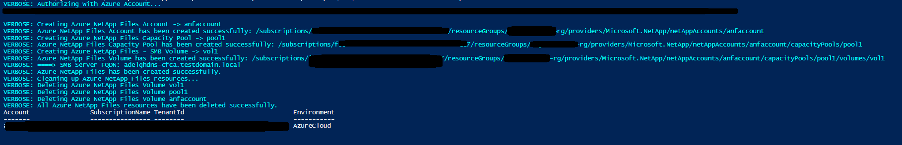

# Azure NetAppFiles SDK Sample - Dual-Protocol for PowerShell 

This project demonstrates how to create a dual-protocol Volume (uses both SMB/NFSv3 protocol types) for Microsoft.NetApp resource provider using PowerShell SDK.

In this sample application we perform the following operations:

* Creations
    * ANF Account
    * Capacity Pool
    * Dual-Protocol Volume
* Deletions
    * Dual-Protocol Volume
    * Capacity Pool
    * ANF Account

>Note: The cleanup execution is disabled by default. If you want to run this end to end with the cleanup, please
>change value of boolean variable 'CleanupResources' in CreateANFDualProtocolVolume.ps1

If you don't already have a Microsoft Azure subscription, you can get a FREE trial account [here](http://go.microsoft.com/fwlink/?LinkId=330212).

## Prerequisites

1. Azure Subscription
1. Subscription needs to be enabled for Azure NetApp Files. For more information, please refer to [this](https://docs.microsoft.com/azure/azure-netapp-files/azure-netapp-files-register#waitlist) document.
1. Make sure you comply with the dual-protocol items described [here](https://docs.microsoft.com/en-us/azure/azure-netapp-files/create-volumes-dual-protocol#considerations) before you proceed.
1. Have the Root CA certificate used by the AD Domain Controller and the Windows clients exported as Base64 encoded X.509 certificate file.
If unsure, steps 2-3 in [this](https://docs.microsoft.com/en-us/azure/azure-netapp-files/create-volumes-dual-protocol#upload-active-directory-certificate-authority-public-root-certificate) document shows how to export the certificate.
Make sure this file is stored at the root of the project.
1. Resource Group created
1. Virtual Network with a delegated subnet to Microsoft.Netapp/volumes resource. For more information, please refer to [Guidelines for Azure NetApp Files network planning](https://docs.microsoft.com/en-us/azure/azure-netapp-files/azure-netapp-files-network-topologies)

# What is netappfiles-powershell-dual-protocol-script-sample doing? 

This sample is dedicated to demonstrate how to create a dual-protocol Volume using an ANF Account name in Azure NetApp Files.
Dual-protocol volumes use both SMB and NFS protocol types.
ANF Account with an Active Directory object using the Root CA certificate mentioned in the prerequisites section.
Then a capacity pool is created, and finally a single dual-protocol volume using Standard service level tier.

There is a section in the code dedicated to remove created resources. By default this script will not remove all created resources;
this behavior is controlled by a boolean variable called 'CleanupResources' in the CreateANFDualProtocolVolume.ps1 class. If you want to erase all resources right after the
creation operations, set this variable to 'true'.
If any of the earlier operations fail for any reason, the cleanup of resources will have to be done manually.

# How the project is structured

The following table describes all files within this solution:

| Folder      | FileName                		| Description                                                                                                                         |
|-------------|---------------------------------|-------------------------------------------------------------------------------------------------------------------------------------|
| Root        | CreateANFDualProtocolVolume.ps1 | Authenticates and executes all operations                                                                                           |

# How to run the console application

1. Clone it locally
    ```powershell
    git clone https://github.com/Azure-Samples/netappfiles-powershell-dual-protocol-script-sample.git
    ```
1. Change folder to **.netappfiles-powershell-dual-protocol-script-sample\src**
1. Open CreateANFDualProtocolVolume.ps1 and edit all the parameters
	 * Save and close
	 * Run the following command
	 ``` powershell
	 CreateANFDualProtocolVolume.ps1
	 ```

Sample output


# References

* [Create a dual-protocol volume for Azure NetApp Files](https://docs.microsoft.com/en-us/azure/azure-netapp-files/create-volumes-dual-protocol)
* [Resource limits for Azure NetApp Files](https://docs.microsoft.com/en-us/azure/azure-netapp-files/azure-netapp-files-resource-limits)
* [Azure Cloud Shell](https://docs.microsoft.com/en-us/azure/cloud-shell/quickstart)
* [Azure NetApp Files documentation](https://docs.microsoft.com/en-us/azure/azure-netapp-files/)
* [Download Azure SDKs](https://azure.microsoft.com/downloads/)
 
